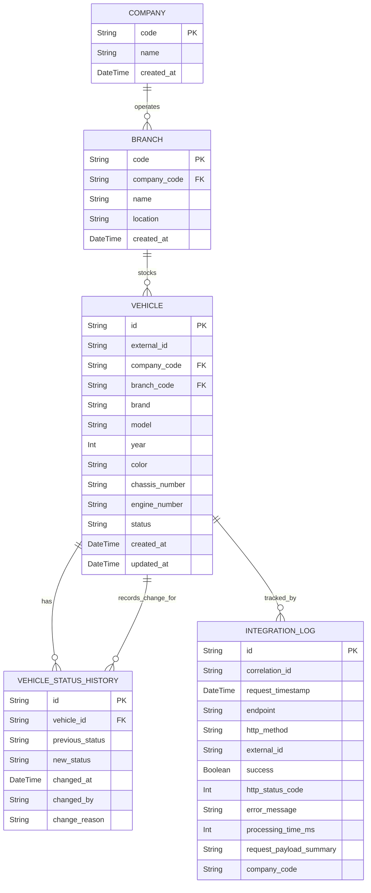

# DATABASE.md: Untitled Project

## Entity Relationship Diagram



## Table Definitions

### VEHICLE
Primary table storing centralized vehicle inventory data. Implements idempotent upsert via unique constraint on (external_id, company_code, branch_code).

| Column | Type | Constraints | Notes |
|:---|:---|:---|:---|
| id | UUID | PK | Auto-generated unique identifier |
| external_id | String(50) | NOT NULL | External system identifier from branch |
| company_code | String(20) | NOT NULL, FK | References COMPANY.code |
| branch_code | String(20) | NOT NULL, FK | References BRANCH.code |
| brand | String(100) | NOT NULL | Vehicle manufacturer (e.g., Hyundai) |
| model | String(100) | NOT NULL | Vehicle model (e.g., Creta) |
| year | Int | NOT NULL | Manufacturing year (e.g., 2026) |
| color | String(50) | NOT NULL | Vehicle color |
| chassis_number | String(50) | NOT NULL, UNIQUE | VIN-equivalent; globally unique |
| engine_number | String(50) | NOT NULL | Engine serial number (sensitive; exclude from logs) |
| status | String(20) | NOT NULL | Enum: IN_TRANSIT, RECEIVED, READY_STOCK, BOOKED, DELIVERED, CANCELLED |
| created_at | DateTime | NOT NULL, DEFAULT NOW() | Timestamp of first data reception |
| updated_at | DateTime | NOT NULL, DEFAULT NOW() | Timestamp of last modification |
| **Unique Constraint** | | (external_id, company_code, branch_code) | Prevents exact duplicates; enables idempotent upsert |

**Indexes:**
- `idx_vehicle_external_id_company_branch` on (external_id, company_code, branch_code) — supports upsert lookups
- `idx_vehicle_chassis_number` on (chassis_number) — detects conflicts with different external_id
- `idx_vehicle_company_code` on (company_code) — filters by company
- `idx_vehicle_branch_code` on (branch_code) — filters by branch
- `idx_vehicle_status` on (status) — filters by status
- `idx_vehicle_brand_model` on (brand, model) — supports brand/model filtering and top-5 models query
- `idx_vehicle_updated_at` on (updated_at) — sorts by update time; supports "updated today" query

---

### VEHICLE_STATUS_HISTORY
Audit trail table recording every status change. Enables compliance reporting and status lifecycle analysis.

| Column | Type | Constraints | Notes |
|:---|:---|:---|:---|
| id | UUID | PK | Auto-generated unique identifier |
| vehicle_id | UUID | NOT NULL, FK | References VEHICLE.id |
| previous_status | String(20) | NOT NULL | Status before change (e.g., RECEIVED) |
| new_status | String(20) | NOT NULL | Status after change (e.g., READY_STOCK) |
| changed_at | DateTime | NOT NULL | Timestamp of status change (UTC) |
| changed_by | String(100) | NOT NULL | System identifier or user ID (e.g., "SYSTEM", "admin@company.com") |
| change_reason | String(500) | NULLABLE | Optional reason for status change |

**Indexes:**
- `idx_status_history_vehicle_id` on (vehicle_id) — retrieves history for specific vehicle
- `idx_status_history_changed_at` on (changed_at) — supports time-range queries
- `idx_status_history_vehicle_changed_at` on (vehicle_id, changed_at) — composite for efficient history retrieval

**Partitioning Strategy (Future):**
- Partition by month on `changed_at` to manage table growth; archive partitions older than 90 days

---

### INTEGRATION_LOG
Audit trail for all API requests (success and failure). Enables debugging, compliance auditing, and performance monitoring.

| Column | Type | Constraints | Notes |
|:---|:---|:---|:---|
| id | UUID | PK | Auto-generated unique identifier |
| correlation_id | String(50) | NOT NULL, UNIQUE | Request tracing ID; enables idempotency detection |
| request_timestamp | DateTime | NOT NULL | Timestamp when request was received (UTC) |
| endpoint | String(100) | NOT NULL | API endpoint (e.g., "/api/vehicles") |
| http_method | String(10) | NOT NULL | HTTP method (GET, POST, etc.) |
| external_id | String(50) | NULLABLE | Vehicle external_id (null for non-vehicle endpoints) |
| success | Boolean | NOT NULL | True if request succeeded, false if failed |
| http_status_code | Int | NOT NULL | HTTP response code (200, 400, 409, 500, etc.) |
| error_message | String(500) | NULLABLE | Error details if success=false |
| processing_time_ms | Int | NOT NULL | Request processing duration in milliseconds |
| request_payload_summary | String(1000) | NULLABLE | Sanitized request body (excludes engine_number, chassis_number) |
| company_code | String(20) | NULLABLE | Company code from request (for filtering logs) |

**Indexes:**
- `idx_integration_log_correlation_id` on (correlation_id) — detects duplicate requests (idempotency)
- `idx_integration_log_request_timestamp` on (request_timestamp) — supports time-range filtering
- `idx_integration_log_external_id` on (external_id) — filters logs by vehicle
- `idx_integration_log_success` on (success) — filters by success/failure
- `idx_integration_log_company_code` on (company_code) — filters by company
- `idx_integration_log_endpoint_timestamp` on (endpoint, request_timestamp) — supports endpoint-specific analytics

**Retention Policy:**
- Keep hot logs for 90 days
- Archive logs older than 90 days to separate storage (e.g., S3, cold database)
- Implement automated cleanup job to delete archived logs after 1 year

---

### COMPANY
Lookup table for company codes. Pre-configured; no self-service registration in MVP.

| Column | Type | Constraints | Notes |
|:---|:---|:---|:---|
| code | String(20) | PK | Company identifier (e.g., "PT-AKA") |
| name | String(200) | NOT NULL | Company full name |
| created_at | DateTime | NOT NULL, DEFAULT NOW() | Record creation timestamp |

**Sample Data:**
```
code: "PT-AKA", name: "PT Astra Kendaraan Andalan"
code: "PT-AJN", name: "PT Astra Jaya Niaga"
```

---

### BRANCH
Lookup table for branch codes. Pre-configured; linked to COMPANY.

| Column | Type | Constraints | Notes |
|:---|:---|:---|:---|
| code | String(20) | PK | Branch identifier (e.g., "JKT01") |
| company_code | String(20) | NOT NULL, FK | References COMPANY.code |
| name | String(200) | NOT NULL | Branch name (e.g., "Jakarta Pusat") |
| location | String(500) | NULLABLE | Branch address or location details |
| created_at | DateTime | NOT NULL, DEFAULT NOW() | Record creation timestamp |

**Indexes:**
- `idx_branch_company_code` on (company_code) — retrieves branches for specific company

**Sample Data:**
```
code: "JKT01", company_code: "PT-AKA", name: "Jakarta Pusat"
code: "JKT02", company_code: "PT-AKA", name: "Jakarta Selatan"
code: "SBY01", company_code: "PT-AJN", name: "Surabaya"
```

---

## Prisma Schema

```prisma
// prisma/schema.prisma

generator client {
  provider = "prisma-client-js"
}

datasource db {
  provider = "postgresql"
  url      = env("DATABASE_URL")
}

model Company {
  code      String    @id @db.VarChar(20)
  name      String    @db.VarChar(200)
  createdAt DateTime  @default(now()) @map("created_at")
  branches  Branch[]
  vehicles  Vehicle[]

  @@map("company")
}

model Branch {
  code        String    @id @db.VarChar(20)
  companyCode String    @map("company_code") @db.VarChar(20)
  name        String    @db.VarChar(200)
  location    String?   @db.VarChar(500)
  createdAt   DateTime  @default(now()) @map("created_at")
  company     Company   @relation(fields: [companyCode], references: [code], onDelete: Cascade)
  vehicles    Vehicle[]

  @@index([companyCode])
  @@map("branch")
}

model Vehicle {
  id              String                    @id @default(cuid())
  externalId      String                    @map("external_id") @db.VarChar(50)
  companyCode     String                    @map("company_code") @db.VarChar(20)
  branchCode      String                    @map("branch_code") @db.VarChar(20)
  brand           String                    @db.VarChar(100)
  model           String                    @db.VarChar(100)
  year            Int
  color           String                    @db.VarChar(50)
  chassisNumber   String                    @unique @map("chassis_number") @db.VarChar(50)
  engineNumber    String                    @map("engine_number") @db.VarChar(50)
  status          String                    @db.VarChar(20)
  createdAt       DateTime                  @default(now()) @map("created_at")
  updatedAt       DateTime                  @updatedAt @map("updated_at")
  company         Company                   @relation(fields: [companyCode], references: [code], onDelete: Cascade)
  branch          Branch                    @relation(fields: [branchCode], references: [code], onDelete: Cascade)
  statusHistory   VehicleStatusHistory[]
  integrationLogs IntegrationLog[]

  @@unique([externalId, companyCode, branchCode])
  @@index([externalId, companyCode, branchCode])
  @@index([companyCode])
  @@index([branchCode])
  @@index([status])
  @@index([brand, model])
  @@index([updatedAt])
  @@map("vehicle")
}

model VehicleStatusHistory {
  id            String    @id @default(cuid())
  vehicleId     String    @map("vehicle_id")
  previousStatus String   @map("previous_status") @db.VarChar(20)
  newStatus     String    @map("new_status") @db.VarChar(20)
  changedAt     DateTime  @map("changed_at")
  changedBy     String    @map("changed_by") @db.VarChar(100)
  changeReason  String?   @map("change_reason") @db.VarChar(500)
  vehicle       Vehicle   @relation(fields: [vehicleId], references: [id], onDelete: Cascade)

  @@index([vehicleId])
  @@index([changedAt])
  @@index([vehicleId, changedAt])
  @@map("vehicle_status_history")
}

model IntegrationLog {
  id                   String    @id @default(cuid())
  correlationId        String    @unique @map("correlation_id") @db.VarChar(50)
  requestTimestamp     DateTime  @map("request_timestamp")
  endpoint             String    @db.VarChar(100)
  httpMethod           String    @map("http_method") @db.VarChar(10)
  externalId           String?   @map("external_id") @db.VarChar(50)
  success              Boolean
  httpStatusCode       Int       @map("http_status_code")
  errorMessage         String?   @map("error_message") @db.VarChar(500)
  processingTimeMs     Int       @map("processing_time_ms")
  requestPayloadSummary String?  @map("request_payload_summary") @db.VarChar(1000)
  companyCode          String?   @map("company_code") @db.VarChar(20)
  vehicle              Vehicle?  @relation(fields: [externalId, companyCode], references: [externalId, companyCode], onDelete: SetNull)

  @@index([correlationId])
  @@index([requestTimestamp])
  @@index([externalId])
  @@index([success])
  @@index([companyCode])
  @@index([endpoint, requestTimestamp])
  @@map("integration_log")
}
```

---

## Data Validation & Constraints

### Vehicle Status Enum
Allowed values for `VEHICLE.status` field:
- `IN_TRANSIT` — Vehicle in transit from supplier/factory to branch
- `RECEIVED` — Vehicle received at branch, awaiting inspection
- `READY_STOCK` — Vehicle ready for sale/booking
- `BOOKED` — Vehicle booked by customer
- `DELIVERED` — Vehicle delivered to customer
- `CANCELLED` — Vehicle cancelled or removed from inventory

### Unique Constraints
1. **Vehicle Deduplication:** `UNIQUE(external_id, company_code, branch_code)` — prevents exact duplicates from same branch system
2. **Chassis Number Uniqueness:** `UNIQUE(chassis_number)` — enforces global uniqueness; detects conflicts with different external_id
3. **Correlation ID Uniqueness:** `UNIQUE(correlation_id)` in INTEGRATION_LOG — enables idempotency detection

### Foreign Key Constraints
- `VEHICLE.company_code` → `COMPANY.code` (CASCADE delete)
- `VEHICLE.branch_code` → `BRANCH.code` (CASCADE delete)
- `BRANCH.company_code` → `COMPANY.code` (CASCADE delete)
- `VEHICLE_STATUS_HISTORY.vehicle_id` → `VEHICLE.id` (CASCADE delete)
- `INTEGRATION_LOG.externalId, companyCode` → `VEHICLE.externalId, companyCode` (SET NULL on delete)

### Required Fields
**POST /api/vehicles request validation:**
- `external_id` — required, max 50 chars
- `company_code` — required, max 20 chars, must exist in COMPANY table
- `branch_code` — required, max 20 chars, must exist in BRANCH table
- `brand` — required, max 100 chars
- `model` — required, max 100 chars
- `year` — required, integer, range 1900–2100
- `color` — required, max 50 chars
- `chassis_number` — required, max 50 chars, must be unique globally
- `engine_number` — required, max 50 chars
- `status` — required, must be one of: IN_TRANSIT, RECEIVED, READY_STOCK, BOOKED, DELIVERED, CANCELLED
- `updated_at` — required, ISO 8601 format (e.g., "2026-07-20T10:30:00+07:00")

---

## Indexing Strategy

### Query Performance Targets
- **Vehicle lookup by external_id + company_code + branch_code:** < 10ms (upsert operation)
- **Filter vehicles by company_code:** < 50ms (list endpoint)
- **Filter vehicles by status:** < 50ms (dashboard query)
- **Top-5 models query:** < 100ms (dashboard query)
- **Status history retrieval:** < 50ms (detail endpoint)
- **Integration log search:** < 100ms (audit endpoint)

### Index Definitions

| Index Name | Table | Columns | Purpose |
|:---|:---|:---|:---|
| `idx_vehicle_external_id_company_branch` | VEHICLE | (external_id, company_code, branch_code) | Upsert lookups; idempotency |
| `idx_vehicle_chassis_number` | VEHICLE | (chassis_number) | Conflict detection |
| `idx_vehicle_company_code` | VEHICLE | (company_code) | Filter by company |
| `idx_vehicle_branch_code` | VEHICLE | (branch_code) | Filter by branch |
| `idx_vehicle_status` | VEHICLE | (status) | Filter by status; dashboard aggregation |
| `idx_vehicle_brand_model` | VEHICLE | (brand, model) | Filter by brand/model; top-5 models query |
| `idx_vehicle_updated_at` | VEHICLE | (updated_at) | Sort by update time; "updated today" query |
| `idx_status_history_vehicle_id` | VEHICLE_STATUS_HISTORY | (vehicle_id) | Retrieve history for vehicle |
| `idx_status_history_changed_at` | VEHICLE_STATUS_HISTORY | (changed_at) | Time-range queries |
| `idx_status_history_vehicle_changed_at` | VEHICLE_STATUS_HISTORY | (vehicle_id, changed_at) | Efficient history retrieval |
| `idx_integration_log_correlation_id` | INTEGRATION_LOG | (correlation_id) | Idempotency detection |
| `idx_integration_log_request_timestamp` | INTEGRATION_LOG | (request_timestamp) | Time-range filtering |
| `idx_integration_log_external_id` | INTEGRATION_LOG | (external_id) | Filter logs by vehicle |
| `idx_integration_log_success` | INTEGRATION_LOG | (success) | Filter by success/failure |
| `idx_integration_log_company_code` | INTEGRATION_LOG | (company_code) | Filter by company |
| `idx_integration_log_endpoint_timestamp` | INTEGRATION_LOG | (endpoint, request_timestamp) | Endpoint-specific analytics |
| `idx_branch_company_code` | BRANCH | (company_code) | Retrieve branches for company |

---

## Migration Strategy

### Initial Setup (Migration 001)
```sql
-- Create COMPANY table
CREATE TABLE company (
  code VARCHAR(20) PRIMARY KEY,
  name VARCHAR(200) NOT NULL,
  created_at TIMESTAMP DEFAULT CURRENT_TIMESTAMP
);

-- Create BRANCH table
CREATE TABLE branch (
  code VARCHAR(20) PRIMARY KEY,
  company_code VARCHAR(20) NOT NULL REFERENCES company(code) ON DELETE CASCADE,
  name VARCHAR(200) NOT NULL,
  location VARCHAR(500),
  created_at TIMESTAMP DEFAULT CURRENT_TIMESTAMP
);
CREATE INDEX idx_branch_company_code ON branch(company_code);

-- Create VEHICLE table
CREATE TABLE vehicle (
  id TEXT PRIMARY KEY,
  external_id VARCHAR(50) NOT NULL,
  company_code VARCHAR(20) NOT NULL REFERENCES company(code) ON DELETE CASCADE,
  branch_code VARCHAR(20) NOT NULL REFERENCES branch(code) ON DELETE CASCADE,
  brand VARCHAR(100) NOT NULL,
  model VARCHAR(100) NOT NULL,
  year INT NOT NULL,
  color VARCHAR(50) NOT NULL,
  chassis_number VARCHAR(50) NOT NULL UNIQUE,
  engine_number VARCHAR(50) NOT NULL,
  status VARCHAR(20) NOT NULL,
  created_at TIMESTAMP DEFAULT CURRENT_TIMESTAMP,
  updated_at TIMESTAMP DEFAULT CURRENT_TIMESTAMP,
  UNIQUE(external_id, company_code, branch_code)
);
CREATE INDEX idx_vehicle_external_id_company_branch ON vehicle(external_id, company_code, branch_code);
CREATE INDEX idx_vehicle_chassis_number ON vehicle(chassis_number);
CREATE INDEX idx_vehicle_company_code ON vehicle(company_code);
CREATE INDEX idx_vehicle_branch_code ON vehicle(branch_code);
CREATE INDEX idx_vehicle_status ON vehicle(status);
CREATE INDEX idx_vehicle_brand_model ON vehicle(brand, model);
CREATE INDEX idx_vehicle_updated_at ON vehicle(updated_at);

-- Create VEHICLE_STATUS_HISTORY table
CREATE TABLE vehicle_status_history (
  id TEXT PRIMARY KEY,
  vehicle_id TEXT NOT NULL REFERENCES vehicle(id) ON DELETE CASCADE,
  previous_status VARCHAR(20) NOT NULL,
  new_status VARCHAR(20) NOT NULL,
  changed_at TIMESTAMP NOT NULL,
  changed_by VARCHAR(100) NOT NULL,
  change_reason VARCHAR(500)
);
CREATE INDEX idx_status_history_vehicle_id ON vehicle_status_history(vehicle_id);
CREATE INDEX idx_status_history_changed_at ON vehicle_status_history(changed_at);
CREATE INDEX idx_status_history_vehicle_changed_at ON vehicle_status_history(vehicle_id, changed_at);

-- Create INTEGRATION_LOG table
CREATE TABLE integration_log (
  id TEXT PRIMARY KEY,
  correlation_id VARCHAR(50) NOT NULL UNIQUE,
  request_timestamp TIMESTAMP NOT NULL,
  endpoint VARCHAR(100) NOT NULL,
  http_method VARCHAR(10) NOT NULL,
  external_id VARCHAR(50),
  success BOOLEAN NOT NULL,
  http_status_code INT NOT NULL,
  error_message VARCHAR(500),
  processing_time_ms INT NOT NULL,
  request_payload_summary VARCHAR(1000),
  company_code VARCHAR(20)
);
CREATE INDEX idx_integration_log_correlation_id ON integration_log(correlation_id);
CREATE INDEX idx_integration_log_request_timestamp ON integration_log(request_timestamp);
CREATE INDEX idx_integration_log_external_id ON integration_log(external_id);
CREATE INDEX idx_integration_log_success ON integration_log(success);
CREATE INDEX idx_integration_log_company_code ON integration_log(company_code);
CREATE INDEX idx_integration_log_endpoint_timestamp ON integration_log(endpoint, request_timestamp);
```

### Seed Data (Migration 002)
```sql
-- Insert sample companies
INSERT INTO company (code, name) VALUES
  ('PT-AKA', 'PT Astra Kendaraan Andalan'),
  ('PT-AJN', 'PT Astra Jaya Niaga');

-- Insert sample branches
INSERT INTO branch (code, company_code, name, location) VALUES
  ('JKT01', 'PT-AKA', 'Jakarta Pusat', 'Jl. Sudirman, Jakarta'),
  ('JKT02', 'PT-AKA', 'Jakarta Selatan', 'Jl. Gatot Subroto, Jakarta'),
  ('SBY01', 'PT-AJN', 'Surabaya', 'Jl. Ahmad Yani, Surabaya');
```

### Prisma Migrations
Run `npx prisma migrate dev --name init` to generate and apply migrations from schema.

---

## Performance Optimization

### Query Optimization Tips
1. **Vehicle List Endpoint:** Use indexed filters (company_code, branch_code, status) before pagination
2. **Dashboard Summary:** Cache results for 5 minutes; invalidate on vehicle status change
3. **Status History:** Retrieve only last 10 changes by default; support pagination for full history
4. **Integration Logs:** Partition by month on `request_timestamp` after 90 days to maintain query speed

### Connection Pooling
- **Min Connections:** 5
- **Max Connections:** 20
- **Idle Timeout:** 30 seconds
- **Connection Timeout:** 10 seconds
- **Monitor:** Alert if active connections exceed 16 (80% of max)

### Caching Strategy
- **Dashboard Summary:** 5-minute TTL; invalidate on POST /api/vehicles success
- **Company/Branch Lookup:** 24-hour TTL (static data)
- **Vehicle Detail:** No caching (always fresh)
- **Integration Logs:** No caching (audit trail must be current)

---

## Data Retention & Archival

### Hot Storage (Active Database)
- **VEHICLE:** Indefinite (core business data)
- **VEHICLE_STATUS_HISTORY:** 90 days (compliance requirement)
- **INTEGRATION_LOG:** 90 days (audit trail)
- **COMPANY, BRANCH:** Indefinite (reference data)

### Archive Strategy
- **Automated Job:** Run daily at 02:00 UTC to identify records older than 90 days
- **Archive Destination:** PostgreSQL archive schema or S3 (cold storage)
- **Retention:** Keep archived logs for 1 year; delete after 1 year
- **Restore Procedure:** Document manual restore process for compliance audits

### Cleanup Job (Pseudocode)
```
Daily at 02:00 UTC:
  1. Identify VEHICLE_STATUS_HISTORY records with changed_at < NOW() - 90 days
  2. Export to archive schema or S3
  3. Delete from hot storage
  4. Identify INTEGRATION_LOG records with request_timestamp < NOW() - 90 days
  5. Export to archive schema or S3
  6. Delete from hot storage
  7. Log job completion and record count
```

---

## Disaster Recovery & Backup

### Backup Strategy
- **Frequency:** Daily automated backups at 03:00 UTC
- **Retention:** 30-day rolling window (keep last 30 daily backups)
- **Destination:** Managed database service (AWS RDS, Google Cloud SQL) or external storage (S3)
- **Testing:** Monthly restore test to verify backup integrity

### Recovery Procedures
1. **Point-in-Time Recovery (PITR):** Restore database to specific timestamp (within 30 days)
2. **Full Restore:** Restore latest backup to new database instance
3. **Partial Restore:** Restore specific tables (e.g., VEHICLE only) if needed
4. **RTO (Recovery Time Objective):** < 1 hour
5. **RPO (Recovery Point Objective):** < 1 day

### High Availability (Future)
- **Read Replicas:** Deploy read-only replicas for dashboard queries (v2)
- **Failover:** Automatic failover to standby database on primary failure (v2)
- **Multi-Region:** Replicate to secondary region for disaster recovery (v2)

---

## Security & Data Protection

### Sensitive Data Handling
- **Engine Number:** Exclude from all API responses; store in database only for internal reference
- **Chassis Number:** Exclude from integration logs; store hash only in logs for matching
- **Correlation ID:** Use for request tracing; never expose in error messages to clients
- **Request Payload:** Sanitize before logging; exclude engine_number, chassis_number, any PII

### Encryption
- **In Transit:** TLS 1.3 for all API communication
- **At Rest:** Enable PostgreSQL encryption (pgcrypto extension) for sensitive columns (optional for MVP)
- **Database Credentials:** Store in environment variables; rotate quarterly

### Access Control
- **API Authentication:** Auth.js (NextAuth) required for all endpoints except /health
- **Branch Systems:** Authenticate via API key or OAuth2 token
- **Operations Users:** Role-based access (see PRD.md for permissions matrix)
- **Admin Users:** Full access to all endpoints and logs

### Audit Trail
- **All Changes:** Log to INTEGRATION_LOG with correlation_id for traceability
- **Status Changes:** Record in VEHICLE_STATUS_HISTORY with changed_by and timestamp
- **Compliance:** Retain logs for 90 days minimum; archive for 1 year

---

## Monitoring & Observability

### Key Metrics to Track
- **Database Connection Pool:** Active connections, idle connections, wait time
- **Query Performance:** Slow query log (queries > 1 second); p95, p99 latencies
- **Table Sizes:** Monitor VEHICLE, VEHICLE_STATUS_HISTORY, INTEGRATION_LOG growth
- **Index Health:** Monitor index fragmentation; rebuild if > 30% fragmented
- **Disk Usage:** Alert if database size exceeds 80% of allocated storage

### Alerts
- **Connection Pool Exhaustion:** Alert if active connections > 16 (80% of max)
- **Slow Queries:** Alert if p95 query time > 500ms
- **Disk Space:** Alert if usage > 80% of allocated
- **Backup Failure:** Alert if daily backup fails
- **Data Anomalies:** Alert if duplicate external_ids detected (should be 0)

### Logging
- **Structured Logs:** JSON format with timestamp, level, message, context
- **Log Levels:** DEBUG, INFO, WARN, ERROR
- **Retention:** 30 days in application logs; 90 days in database audit logs
- **Aggregation:** Send logs to centralized logging service (e.g., ELK, Datadog)

---

## Appendix: SQL Utilities

### Dashboard Summary Query
```sql
SELECT
  COUNT(*) as total_vehicles,
  COUNT(CASE WHEN DATE(updated_at) = CURRENT_DATE THEN 1 END) as updated_today,
  COUNT(CASE WHEN status = 'IN_TRANSIT' THEN 1 END) as in_transit_count,
  COUNT(CASE WHEN status = 'RECEIVED' THEN 1 END) as received_count,
  COUNT(CASE WHEN status = 'READY_STOCK' THEN 1 END) as ready_stock_count,
  COUNT(CASE WHEN status = 'BOOKED' THEN 1 END) as booked_count,
  COUNT(CASE WHEN status = 'DELIVERED' THEN 1 END) as delivered_count,
  COUNT(CASE WHEN status = 'CANCELLED' THEN 1 END) as cancelled_count
FROM vehicle;
```

### Top-5 Models Query
```sql
SELECT model, COUNT(*) as count
FROM vehicle
GROUP BY model
ORDER BY count DESC
LIMIT 5;
```

### Duplicate Detection Query
```sql
SELECT chassis_number, COUNT(*) as count
FROM vehicle
GROUP BY chassis_number
HAVING COUNT(*) > 1;
```

### Status History for Vehicle Query
```sql
SELECT previous_status, new_status, changed_at, changed_by, change_reason
FROM vehicle_status_history
WHERE vehicle_id = $1
ORDER BY changed_at DESC;
```

### Integration Log Search Query
```sql
SELECT correlation_id, request_timestamp, endpoint, http_method, external_id, success, http_status_code, processing_time_ms
FROM integration_log
WHERE success = $1
  AND request_timestamp >= $2
  AND request_timestamp <= $3
ORDER BY request_timestamp DESC
LIMIT $4 OFFSET $5;
```